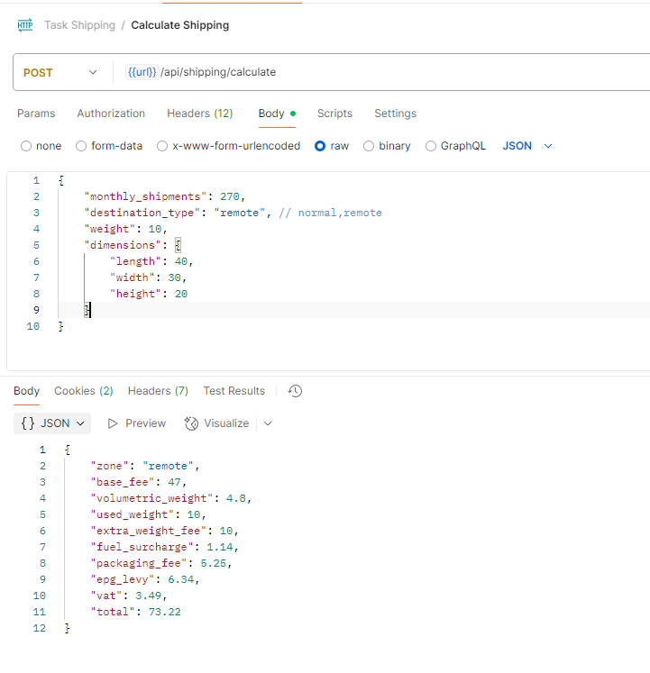

# 📦 O2Mart Shipping Cost API

This project is a **Laravel-based API** for calculating dynamic shipping costs for O2Mart, based on:
- Shipping zones (Normal or Remote)
- Weight and dimensions
- Monthly shipment volume
- Surcharges (fuel, packaging, VAT, etc.)

GitHub Repository: [https://github.com/Moemen-Gaballah/o2mart-shipping](https://github.com/Moemen-Gaballah/o2mart-shipping)

---

## 🚀 Installation & Setup

### 1. Clone the Repository
```bash
git clone https://github.com/Moemen-Gaballah/o2mart-shipping.git
cd o2mart-shipping
```

### 2. Install Dependencies
```bash
composer install
```

### 3. Environment Configuration
```bash
cp .env.example .env
```

### 4. Generate App Key
```bash
php artisan key:generate
```

### 5. Run Migrations
```bash
php artisan migrate
```

### 6. Start Local Server
```bash
php artisan serve
```

### 7. Postman Collection in project root
```
./Task Shipping.postman_collection.json
```




---

## 🧪 API Usage

### Endpoint

**POST** `/api/shipping/calculate`

### Request Body (JSON)
```json
{
    "monthly_shipments": 270,
    "destination_type": "remot[README (1).md](../../../Downloads/README%20%281%29.md)e", // normal,remote
    "weight": 10,
    "dimensions": {
        "length": 40,
        "width": 30,
        "height": 20
    }
}
```

### Response
```json
{
    "zone": "remote",
    "base_fee": 47,
    "volumetric_weight": 4.8,
    "used_weight": 10,
    "extra_weight_fee": 10,
    "fuel_surcharge": 1.14,
    "packaging_fee": 5.25,
    "epg_levy": 6.34,
    "vat": 3.49,
    "total": 73.22
}
```

---

## 📚 Project Structure Highlights

- `ShippingController`: Handles API requests.
- `ShippingCalculatorService`: Core logic for dynamic rule-based calculation.
- `RemoteAreasSeeder`: Seeds 29 remote areas into the database.
- `remote_areas` table: Used to determine if an area is “remote”.

---

## 📬 Postman Collection

You can import the following sample POST request into Postman:
- **Method**: POST
- **URL**: `http://localhost:8000/api/shipping/calculate`
- **Body**: raw JSON (as shown above)

### TODO Backend
- [] Apis and DB for (destination_type, monthly_shipments).
- [] use trait APIResponse for all response.
- [] refactor ShippingCalculatorService.
- [] Enum File.
- [] Docker file and Docker compose
- [] Unit test
- etc...


